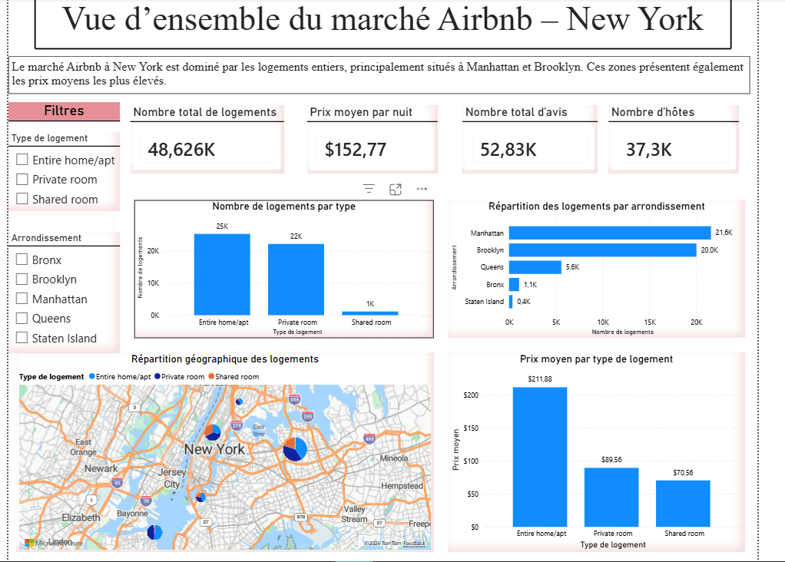
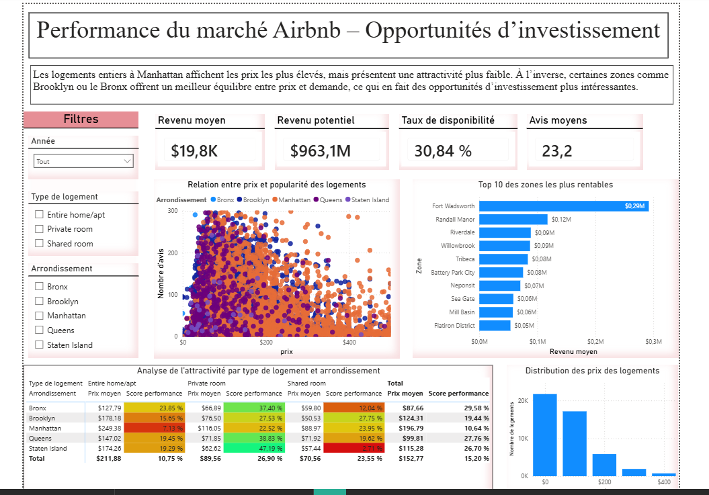

# 📊 Analyse du marché Airbnb à New York

## 🎯 Objectif

Ce projet vise à analyser le marché Airbnb à New York afin d’identifier les tendances clés et les opportunités d’investissement locatif.
L’objectif est de comprendre la relation entre le prix, la demande et la disponibilité des logements pour orienter des décisions stratégiques.

---

## 📁 Présentation du Dashboard

Le dashboard a été réalisé avec Power BI et se compose de deux pages principales :

---

## 🟦 Page 1 – Vue d’ensemble du marché

Cette page fournit une vision globale du marché Airbnb à New York.
### 💡 Objectif :

Comprendre la structure du marché et identifier les zones les plus actives.

### 🔍 Contenu :

* Nombre total de logements
* Prix moyen par nuit
* Nombre total d’avis
* Répartition des logements par type (logement entier, chambre privée…)
* Répartition par arrondissement (Manhattan, Brooklyn…)
* Carte géographique des logements

  

---

## 🟥 Page 2 – Performance & opportunités

Cette page est dédiée à l’analyse approfondie et à l’identification des opportunités d’investissement.

### 💡 Objectif :

Identifier les zones offrant le meilleur équilibre entre prix et demande, afin de repérer les opportunités les plus rentables.

### 🔍 Contenu :

* Revenu potentiel et revenu moyen
* Taux de disponibilité des logements
* Score d’attractivité (rapport entre prix et demande)
* Distribution des prix des logements
* Analyse de l’attractivité par arrondissement et type de logement (heatmap)
* Relation entre prix et popularité (nuage de points)

---

## 💡 Insights clés

* Manhattan présente les prix les plus élevés mais une attractivité plus faible
* Brooklyn et certaines zones du Bronx offrent un meilleur rapport entre prix et demande
* La majorité des logements se situe entre 50$ et 200$ par nuit
* Les logements moins chers génèrent généralement plus d’avis, indiquant une demande plus forte

---

## 🛠️ Outils utilisés

* Power BI (visualisation)
* DAX (mesures et indicateurs)
* Power Query (nettoyage des données)

---

## 📊 Dataset

* Source : Kaggle – AB_NYC_2019
* Données : prix, type de logement, disponibilité, localisation, avis

---

## 🚀 Auteur

Yawa Silvere ADODO-DAHOUE
